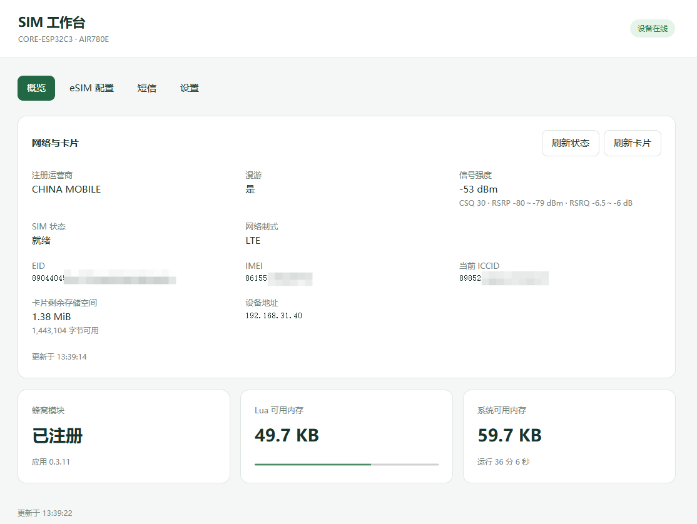
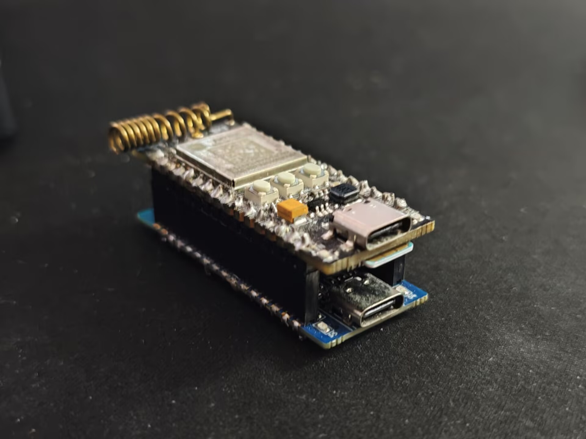

# AIR780E eUICC 短信转发器

基于合宙 CORE-ESP32C3、AIR780E 和 SGP.22 eUICC 的独立设备。ESP32-C3 提供 Wi-Fi 网页面板、LPA 和短信推送，通过 UART 控制 AIR780E。

## 功能

- 查看注册运营商、漫游、信号、SIM 状态、EID、IMEI、ICCID 和卡片剩余容量。
- 查看、启用、停用和删除 Profile；修改显示名称、文字/日期标签，查看基础详情。
- 使用 LPA 激活码下载配置，管理安装、切换和删除产生的通知。
- 接收短信，通过 HTTP 或 Server酱³ 转发。

## 硬件与使用

已使用 CORE-ESP32C3 与 AIR780E 叠插开发板、9eSIM v2 验证。

| ESP32-C3 | AIR780E / 用途 |
| --- | --- |
| GPIO0，UART TX | AIR MRX |
| GPIO1，UART RX | AIR MTX |
| GPIO12 | C3 板载 D4 指示灯 |
| GND | 共地 |

运行时只接 AIR780E USB；刷写时断电拆开，仅接 ESP32C3 USB。

配置并刷写后，从路由器查看 ESP32C3 的地址，在浏览器打开 `http://设备地址/`，填入访问密钥。

## 构建

固件下载见 [固件下载与说明](firmware/prebuilt/README.md)。

应用构建步骤见 [c3/README.md](c3/README.md)。精简 LuatOS 的版本、补丁与构建步骤见 [firmware/README.md](firmware/README.md)。当前 Lua 堆为 136 KiB，脚本分区 128 KiB，文件系统 256 KiB。

烧写前将 [c3/config.example.lua](c3/config.example.lua) 复制为 `c3/config.lua`，再填写配置信息。

实现参考 [LuatOS](https://github.com/openLuat/LuatOS)、[lpac](https://github.com/estkme-group/lpac)、[NekokoLPA2](https://github.com/iebb/NekokoLPA2) 和 [Server酱³ 接口文档](https://sc3.ft07.com/doc)。第三方组件的许可由各自项目提供。
